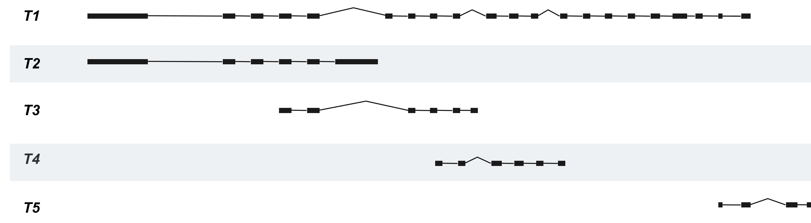
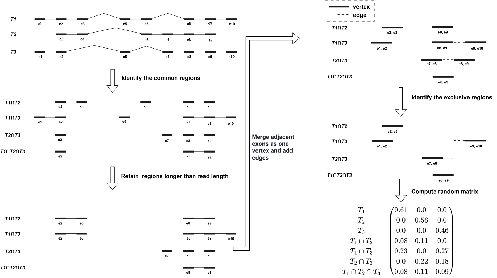
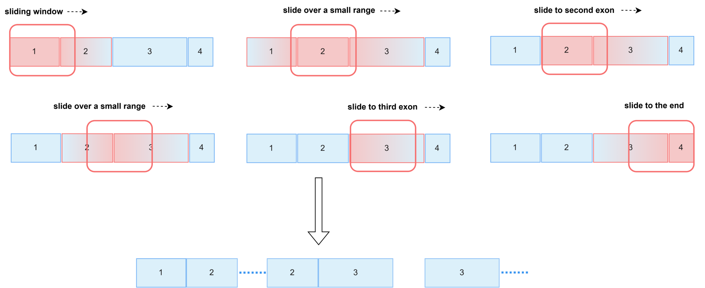
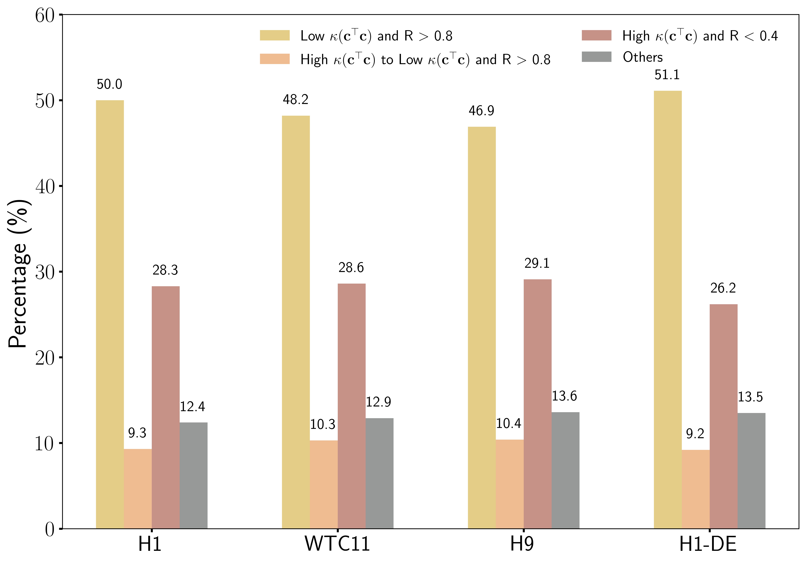

# How to calculate the number of conditions in the transcript space using the relevant code

## ⚠️ Environment Setup Required

**Important**: Before running the code, please set up the required environment. See [ENVIRONMENT_SETUP.md](ENVIRONMENT_SETUP.md) for detailed instructions.

### Quick Setup
```bash
# Using conda (recommended)
conda env create -f environment.yml
conda activate tccn

# Or using pip
pip install -r requirements.txt
```

## Usage

### TCCN Analysis

First through the **process_gene_data** function to process the transcript data, get arrays and gene_dict, and then in the **ComputeC** function to input the previously obtained arrays, gene_dict data and their own choice of read_length, and finally will get a C matrix. (Specific procedures and code can be through the **Example** of this jupyter notebook to learn.)

For example, for the first example in the code, after processing by the **process_gene_data** function, we can get a list 

[[1, 2, 3, 4, 5, 7, 8, 9, 10, 12, 13, 14, 16, 17, 18, 19, 20, 21, 22, 23, 24], [1, 2, 3, 4, 5, 6], [4, 5, 8, 9, 10, 11], [9, 10, 12, 13, 14, 15], [22, 23, 25, 26]], 

and a dictionary 

{1: 919, 2: 184, 3: 179, 4: 176, 5: 106, 6: 945, 7: 82, 8: 91, 9: 107, 10: 90, 11: 81, 12: 157, 13: 107, 14: 103, 15: 85, 16: 135, 17: 96, 18: 138, 19: 117, 20: 166, 21: 386, 22: 180, 23: 79, 24: 216, 25: 216, 26: 95}. 

This corresponds to the composition of the transcript space of the gene, with the list indicating the position of the exon and the dictionary indicating the length of the corresponding exon. The composition of the transcript space is shown below:



After getting the composition of the transcript we use the function ComputeC to calculate the number of conditions under different read lengths, the specific effect is shown in the figure below:


More specifically, we employ graph theory and sliding window methods to compute the C matrix. The following two figures provide computational examples: first demonstrating the computational approach for fixed-length exons using graph theory, and then illustrating the sliding window method for the general case (solution for variable-length exons).
For more detailed proofs, please refer to our paper or the [process_getC.md](process_getC.md/) file.



In addition to this, we have also calculated the proportion of cases that conform to our model according to the above code, and the reference dataset is shown in (https://ftp.ensembl.org/pub/release-112/gtf/homo_sapiens/). The specific statistical results are shown in the following figure. A detailed description of the statistical methodology and results can be found in the paper accompanying the code.



## Real Human Genome Data Processing

For researchers interested in processing real human genome RNA-seq data, we provide comprehensive pipelines in the [Real_Data_Processing](Real_Data_Processing/) directory. These pipelines cover both short-read and long-read sequencing data processing using multiple quantification tools.
